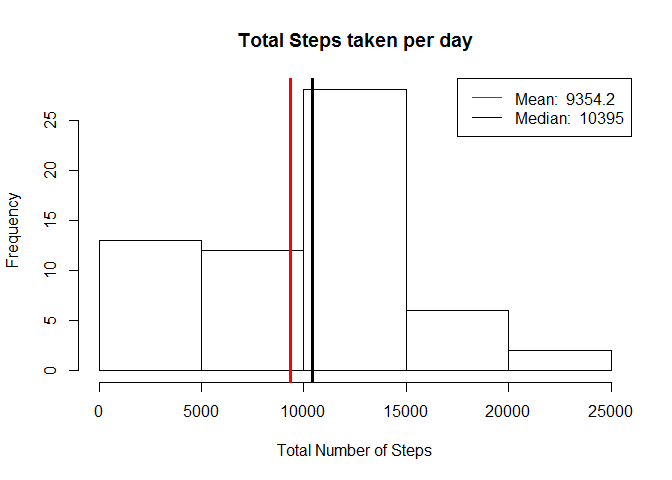

# Reproducible Research: Peer Assessment 1

## Loading and preprocessing the data

```r
wd <-"~/R/RepData/RepData_PeerAssessment1"
if(!file.exists(wd)){dir.create(wd)}
if (getwd()!=wd) {setwd(wd) }

if(!file.exists("./data")){dir.create("./data")}

destzip<- paste0(wd,"/activity.zip");
destfile <- paste0(wd,"/data/activity.csv");
if (!file.exists(destfile) ){
  unzip(zipfile = destzip, exdir = paste0(wd,"/data"))
} 
data <- read.csv(destfile, header = TRUE, skipNul = T, na.strings = c("NA","NULL") )

tidyData <- (subset(data, !is.na(data$steps)))
library("data.table")
```

```
## Warning: package 'data.table' was built under R version 3.2.2
```

```r
dataTable = data.table(data)
dataByDate = dataTable[, list(total_steps = sum(steps, na.rm = T)), 
                          by = date]
```


## What is mean total number of steps taken per day?

```r
hist(dataByDate$total_steps, xlab = 'Total Number of Steps', breaks = 30, main = "Total Steps taken per day")

mean <- round(mean(dataByDate$total_steps),1)
median <- median(dataByDate$total_steps)

#place lines for mean and median on histogram
abline(v=mean, lwd = 3, col = 'red')
abline(v=median, lwd = 3, col = 'black')

legend('topright',lty = 1, col = c("red", "black"),
       legend = c(paste('Mean: ', mean),
       paste('Median: ', median)))
```

 

## What is the average daily activity pattern?

```r
dataByInterval = dataTable[, list(average = mean(steps, na.rm = T)), 
                          by = interval]
                          plot(dataByInterval$interval,dataByInterval$average, type = "l", 
          main = "Average Steps by Time Interval",
          xlab = '5 Minute Time Interval', 
          ylab = 'Average')
        
legend("topright",
       legend = paste("The 5-minute interval with maximum number of steps is the number: ", dataByInterval[which.max(dataByInterval$average), ]$interval), cex = .7
     
       ) 
```

 

## Imputing missing values


## Are there differences in activity patterns between weekdays and weekends?

